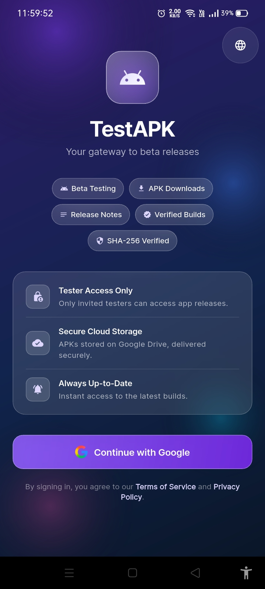
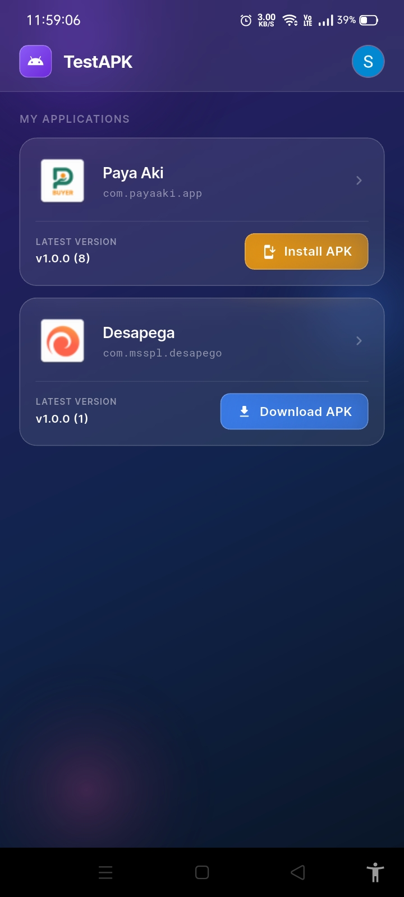
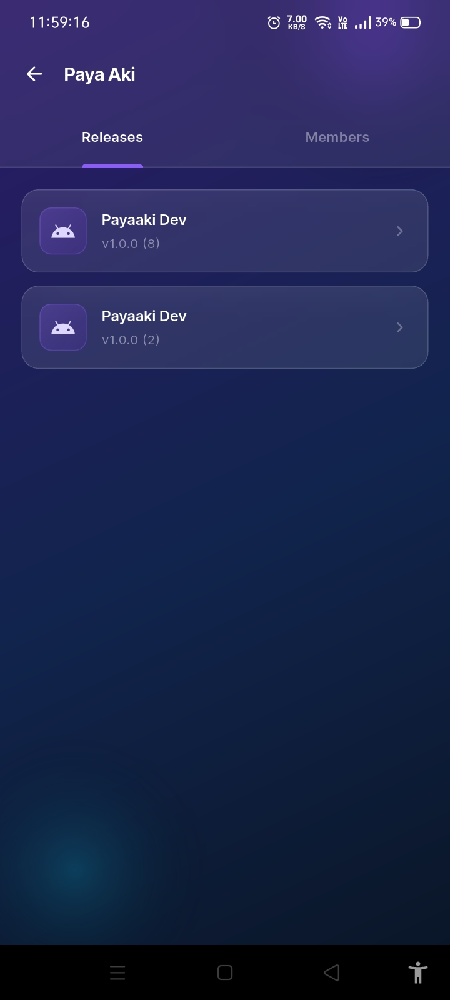
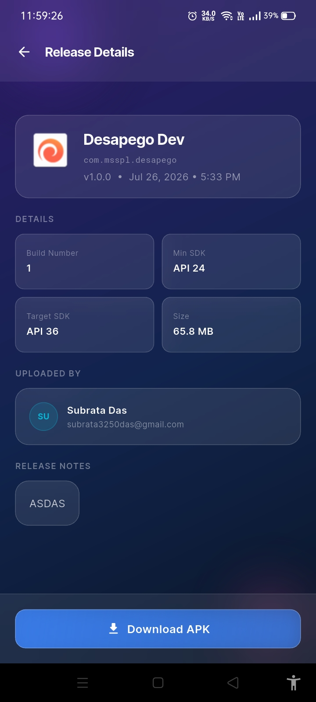
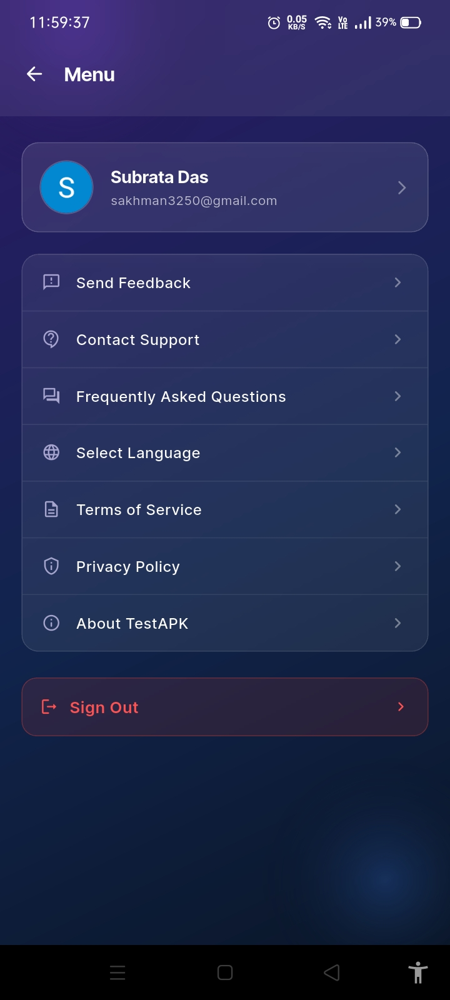
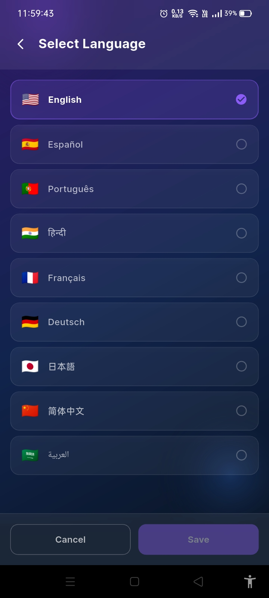

# TestAPK Mobile Application

The Flutter-based mobile application for the TestAPK platform. It is designed for testers to easily browse applications they are invited to, view release history, download APKs, and install them directly on their Android devices.

## Tech Stack & Packages

- **Framework**: Flutter (Dart SDK `^3.12.2`)
- **Authentication**: Google Sign-In (`google_sign_in`)
- **Storage**: Flutter Secure Storage (`flutter_secure_storage`) for secure token management
- **Networking**: `http` for API requests, `cached_network_image` for image caching
- **UI & Styling**:
  - Google Fonts (`google_fonts`)
  - Shimmer (`shimmer`) for loading skeletons
  - Custom responsive glassmorphic design system
- **File & Permissions**:
  - `open_filex` for launching APK installers
  - `path_provider` for managing local downloads
  - `permission_handler` for requesting storage and installation permissions

---

## Prerequisites

- Flutter SDK installed and configured.
- Android SDK (since APK installation is Android-specific).
- An Android device or emulator for testing.

---

## Configuration

The application configuration is centralized in `lib/core/constants.dart`:

1. **API Base URL**:
   Update `kApiBaseUrl` to point to your running backend server.
   - For Android Emulator: `http://10.0.2.2:3000/api/v1`
   - For physical devices: Use your server's public IP or domain (e.g., `https://your-server.com/api/v1`).

2. **Google Client ID**:
   Update `kGoogleClientId` with your Google OAuth Web Client ID from the Google Cloud Console.

---

## Getting Started

1. **Get dependencies**:
   ```bash
   flutter pub get
   ```

2. **Run the application**:
   ```bash
   flutter run
   ```

3. **Build APK**:
   ```bash
   flutter build apk
   ```

---

## Key Features

- **Tester Authentication**: Secure login via Google Sign-In. Only invited testers can access application builds.
- **Invitation Management**: Accept or decline application testing invitations directly from the app.
- **Release History**: Browse all uploaded builds for each application.
- **Detailed Release Info**: View build numbers, minimum/target SDK versions, file sizes, required permissions, and release notes.
- **In-App APK Installation**: Download APKs securely and trigger the Android package installer directly within the app.
- **Premium Glassmorphic UI**: Beautiful iOS-inspired design featuring gradient backgrounds, translucent panels, and smooth micro-animations.

---

## 📸 Screenshots

<h3 align="center">Screenshots</h3>

<table align="center">
  <tr>
    <th>Login Page</th>
    <th>Dashboard</th>
    <th>Release List</th>
  </tr>
  <tr>
    <td align="center">
      
    </td>
    <td align="center">
      
    </td>
    <td align="center">
      
    </td>
  </tr>
</table>

<br />

<table align="center">
  <tr>
    <th>Release Details</th>
    <th>Menu</th>
    <th>Languages</th>
  </tr>
  <tr>
    <td align="center">
      
    </td>
    <td align="center">
      
    </td>
    <td align="center">
      
    </td>
  </tr>
</table>
